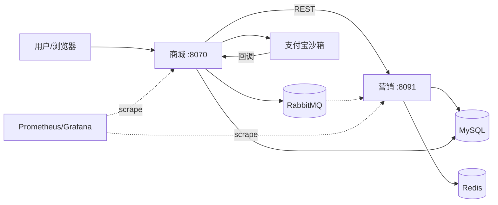

# 书香拼团交易平台

> 双服务 DDD 拼团 + 支付商城：**营销 8091** 负责试算/锁单/结算/退款，**商城 8070** 负责登录/下单/支付宝回调；REST + RabbitMQ + 本地消息表保证跨服务最终一致。  
> 本地演示：Vue 商城 `http://127.0.0.1:5173`（开发）/ `8080`（preview）；API `8070` + `8091`

[](https://www.oracle.com/java/)
[](https://spring.io/projects/spring-boot)
[](https://www.mysql.com/)
[](https://redis.io/)
[](https://www.rabbitmq.com/)
[](LICENSE)

---

## 项目演进（可运维改造）

在完整拼团业务闭环之上，补充可观测与工程化能力：

| 阶段 | 做了什么 |
|------|----------|
| 可观测 | Micrometer + Prometheus + Grafana；`X-Trace-Id` 透传；锁单/支付回调业务指标（见 [MONITORING.md](group-buy-market/docs/dev-ops/MONITORING.md)） |
| 前端 | Vue3 SPA（`mall-web/`）+ 个人中心；顶栏 **智能客服** 跳转 Agent（`:8092`，需单独启动） |
| 压测调优 | 50 并发锁单压测 + `application-perf` 调 Tomcat 线程池 |

---

## 技术栈

| 类别 | 选型 |
|------|------|
| 语言 / 框架 | Java 17 + Spring Boot 2.7 + MyBatis |
| 中间件 | MySQL 8 / Redis 7 (Redisson) / RabbitMQ 3.11 |
| 可观测 | Micrometer / Prometheus / Grafana |
| 架构 | DDD 分层 / 责任链 / 策略模式 / 本地消息表 |
| 部署 | Docker Compose / Nginx / 京东云 2C4G |

---

## 项目结构

```text
s-pay-mall-vs-group-buy/
├── scripts/load/                 # 锁单压测脚本（可选）
├── scripts/chaos/                # 故障演练脚本（可选）
├── group-buy-market/             # 营销服务 :8091
└── s-pay-mall-ddd-market/        # 商城 :8070 + mall-web :5173
```

---

## 架构图



---

## 核心亮点

### 1. 拼团锁单 · 三层防超卖

```text
Redis incr  →  setNx  →  MySQL 条件更新（lock_count < target_count）
```

📂 `group-buy-market-domain/.../lock/filter/TeamStockOccupyRuleFilter.java`

### 2. 跨服务一致性 · 本地消息表 + 补偿

```text
支付成功 → notify_task(0) → MQ/HTTP → 失败则 status=2 → Job/手动补偿
```

📂 `TradeRepository.settlementMarketPayOrder`、`TradeTaskService.execNotifyJob`

### 3. 退款 · 策略模式三态

📂 `group-buy-market-domain/.../refund/strategy/`

### 4. 可观测（本次加深）

- **锁单**：`gbm_lock_order_total` / `gbm_lock_order_duration_seconds`
- **支付回调**：`mall_alipay_notify_total{result=success|duplicate}`
- **补偿积压**：`gbm_notify_task_pending`
- **Dashboard**：`group-buy-market/docs/dev-ops/grafana/dashboards/group-buy-business.json`

### 5. 规则树试算 + DCC 动态配置

责任链锁单、Redis Pub/Sub 热更新活动开关与降级策略。

---

## 快速启动

> 敏感配置使用 `application-dev.yml.example` 复制为 `application-dev.yml` 后本地填写，勿提交密钥。

### 1. 中间件

```bash
cd group-buy-market/docs/dev-ops
docker-compose -f docker-compose-environment.yml up -d
```

### 2. 数据库

```bash
mysql -h 127.0.0.1 -P 13306 -u root -p123456 < group-buy-market/docs/dev-ops/mysql/sql/2-29-group_buy_market.sql
mysql -h 127.0.0.1 -P 13306 -u root -p123456 group_buy_market < group-buy-market/docs/dev-ops/mysql/sql/patch-multi-books.sql
mysql -h 127.0.0.1 -P 13306 -u root -p123456 < s-pay-mall-ddd-market/docs/dev-ops/mysql/sql/s-pay-mall-ddd-market.sql
```

### 3. 启动服务

```bash
# 营销 8091
cd group-buy-market && mvn -DskipTests spring-boot:run -pl group-buy-market-app

# 商城 8070
cd s-pay-mall-ddd-market && mvn -DskipTests spring-boot:run -pl s-pay-mall-ddd-app
```

### 4. 监控栈（可选）

```bash
cd group-buy-market/docs/dev-ops
docker compose -f docker-compose-grafana.yml up -d
# Prometheus http://127.0.0.1:19090  Grafana http://127.0.0.1:4000 (admin/admin123)
```

### 5. Vue 商城（推荐）

```bash
cd s-pay-mall-ddd-market/mall-web
npm install && npm run dev
```

- 登录 / 书城：<http://127.0.0.1:5173/login>
- 智能客服：顶栏入口 → `http://127.0.0.1:8092/group-buy-chat.html`（需另启 `ai-agent-group-buy-cs`）

### 6. 访问（旧版静态页，可选）

- <http://127.0.0.1:8070/catalog.html>

---

## 关键接口

| 服务 | 方法 | 路径 |
|------|------|------|
| 营销 | POST | `/api/v1/gbm/trade/lock_market_pay_order` |
| 营销 | POST | `/api/v1/gbm/trade/settlement_market_pay_order` |
| 商城 | POST | `/api/v1/order/create_pay_order` |
| 商城 | POST | `/api/v1/alipay/alipay_notify_url` |

---

## 模块说明

- [group-buy-market/README.md](group-buy-market/README.md) — 营销中台
- [s-pay-mall-ddd-market/README.md](s-pay-mall-ddd-market/README.md) — 支付商城
- [mall-web/README.md](s-pay-mall-ddd-market/mall-web/README.md) — Vue 商城与智能客服入口

---

## License

[MIT](LICENSE)

